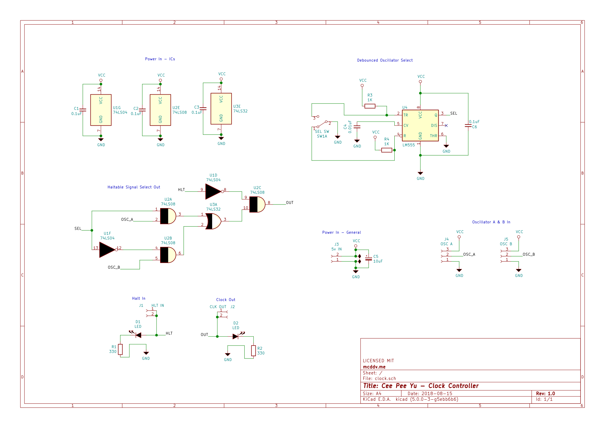

# Clock
In the context of a computer, a clock is a module that provides a timing signal and the ability to halt said signal. This timing signal allows all other modules to behave in an orderly fashion, while the ability to halt allows the computer to stop itself.

All computers have some form of a clock. There are many different types of clocks depending on the exact needs of a computer too, for example, there are,

- Integrated circuits which use have widely configurable ranges
- Resonator circuits which are super fast and very stable
- Non integrated circuits using individual components

Like all things in electronics, there are many ways to achieve the same goal. For our needs we will use the 555 Timer, a timing IC with a wide speed range. We'll talk more about this IC later.

In day to day computing, a CPU runs at a fixed speed or a small range. In our case, we require a bit more from our clock. Given the nature of Cee Pee Yu is to explore how a CPU functions, it needs more than a fixed fast oscillator. Instead, it would be beneficial have the ability to,

- advance the clock by one tick so that we can step through operations one at a time
- slow down or speed up the timing signal on the fly, so we can see operations happening

With the above in mind, the design for our clock is modular. The clock circuit itself supports two external oscillators which can be switched on the fly, as well as the ability to halt.

## The Oscillators
A clocks timing signal is produced by an oscillator, which is a fancy way for saying something that vibrates or swings back and forth. The speed, or frequency, of clock is the number of times an oscillator swings back and forth per second. It is measured in Hertz.

In our case, we require two oscillators, one to cover single tick oscillation, and the other to provide configurable range. As these components are modules unto themselves, they are only briefly discussed below, follow the links in each sub section to explore each oscillator in more detail.

### Oscillator A

- To do...

### Oscillator B

- To do...

## Circuit Diagram

### Breakdown

- To do...

### Power In - General

- To do...

### Power In - IC's

- To do...

### Haltable Signal Out

- To do...

### Debounced Oscillator Select

- To do...

### Oscillator A & B In

- To do...

### Halt In

- To do...

### Clock Out

- To do...
