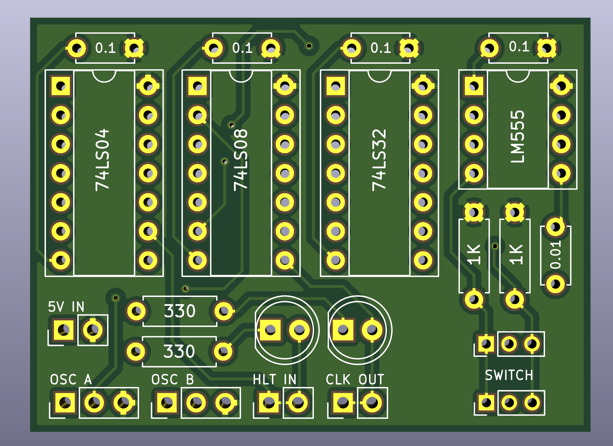
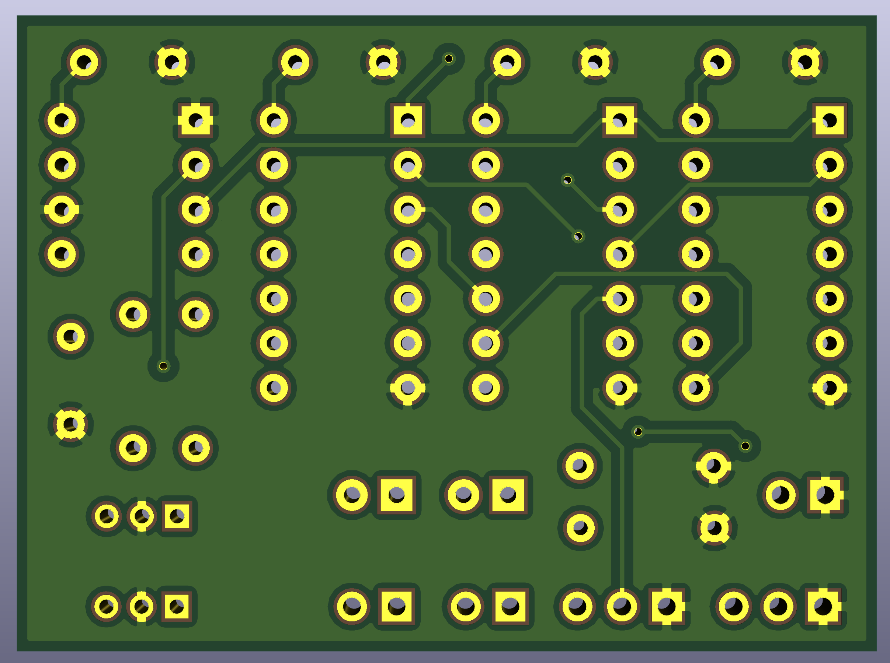

# Clock
In the context of a computer, a clock is a module that provides a timing signal and the ability to halt said signal. This timing signal allows all other modules to behave in an orderly fashion, while the ability to halt allows the computer to stop itself.

All computers have some form of a clock. There are many different types of clocks depending on the exact needs of a computer too, for example, there are,

- Integrated circuits which use have widely configurable ranges
- Resonator circuits which are super fast and very stable
- Non integrated circuits using individual components

Like all things in electronics, there are many ways to achieve the same goal. For our needs we will use the 555 Timer, a timing IC with a wide speed range. We'll talk more about this IC later.

In day to day computing, a CPU runs at a fixed speed or a small range. In our case, we require a bit more from our clock. Given the nature of Cee Pee Yu is to explore how a CPU functions, it needs more than a fixed fast oscillator. Instead, it would be beneficial have the ability to,

- advance the clock by one tick so that we can step through operations one at a time
- slow down or speed up the timing signal on the fly, so we can see operations happening

With the above in mind, the design for our clock is modular. The clock circuit itself supports two external oscillators which can be switched on the fly, as well as the ability to halt.

## Parts List
- 1x 555 Timer
- 1x 74LS04 Quad Inverter
- 1x 74LS08 Quad AND
- 1x 74LS32 Quad OR
- 4x 0.1uF Capacitor
- 1x 0.01uF Capacitor
- 2x 1KOhm Resistor
- 2x 330Ohm Resistor
- 1x 7mm, 6pin, DPDT push toggle switch
- 3x 2Pin male or female headers
- 2x 2Pin male or female headers
- 2x 5mm LED's

__Tip:__ _LS IC's can be substituted with HCT but not HC variants. eg 74HCT04. any digits or codes after the part number are compatible too, eg 74HCT04AN is compatible with 74LS04N but neither are compatible with 74HC04AN or 74HC04 as the work with a different logic voltage range._

## Circuit Diagram

### Printed Circuit Board - Front

### Printed Circuit Board - Back

## Breakdown

- To do...

### Power In - General

- To do...

### Power In - IC's

- To do...

### Haltable Signal Out

- To do...

### Debounced Oscillator Select

- To do...

### Oscillator A & B In

- To do...

### Halt In

- To do...

### Clock Out

- To do...
